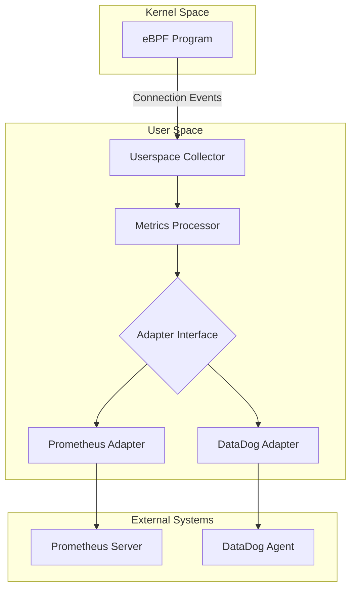

# Gespann

**Real-time network connection observability powered by eBPF**

Gespann is a high-performance network monitoring sidecar that provides deep visibility into TCP/UDP connections without application changes or network overhead. It uses eBPF (Extended Berkeley Packet Filter) to capture connection events directly from the Linux kernel, delivering comprehensive network observability for modern distributed systems.

## What It Does

Gespann tracks every aspect of network connections in real-time:

- **Connection Lifecycle** - Open, close, reset, and failed connection attempts
- **Performance Metrics** - Round-trip time, bandwidth utilization, and connection duration
- **Error Analysis** - Connection failures, resets, and their underlying causes
- **Protocol Distribution** - TCP vs UDP traffic patterns and usage
- **Resource Utilization** - Bytes transferred, connection counts, and throughput

## How It Works

1. **Kernel-Level Monitoring** - eBPF programs attach to kernel functions (`tcp_connect`, `tcp_close`, `tcp_sendmsg`) to capture connection events
2. **Zero-Copy Data Collection** - Events are efficiently transferred from kernel to userspace via ring buffers
3. **Real-Time Processing** - Go userspace program processes events and maintains connection state
4. **Flexible Export** - Adapter architecture supports multiple observability backends (Prometheus, DataDog)

## Intended Purpose

Gespann is designed for:

- **Production Observability** - Monitor microservices, APIs, and distributed systems
- **Performance Debugging** - Identify network bottlenecks, latency issues, and connection problems
- **Security Monitoring** - Detect unusual connection patterns, failed attempts, and network anomalies
- **Capacity Planning** - Understand bandwidth usage, connection patterns, and resource requirements

Perfect for containerized environments, service meshes, and any Linux-based infrastructure requiring network visibility.

## Architecture



## Usage

```bash
# Build
go build -o bin/gespann cmd/tracker/main.go

# Run with default config (Prometheus on :8080)
sudo ./bin/gespann

# Run with custom config
sudo ./bin/gespann -config config.yaml
```

## Configuration

```yaml
log_level: info

adapters:
  - type: prometheus
    settings:
      port: "8080"
  
  - type: datadog
    settings:
      host: "localhost:8125"
```

## Metrics

### Connection Counts
- `gespann_open_connections`: Current open connections
- `gespann_closed_connections_total`: Total closed connections
- `gespann_reset_connections_total`: Total reset connections
- `gespann_failed_connections_total`: Total failed connection attempts
- `gespann_idle_connections`: Idle connections count
- `gespann_total_connections`: Total connections seen

### Performance Metrics
- `gespann_bytes_sent_total`: Total bytes sent across all connections
- `gespann_bytes_received_total`: Total bytes received across all connections
- `gespann_avg_connection_duration_ms`: Average connection duration
- `gespann_avg_rtt_microseconds`: Average round trip time
- `gespann_connection_bandwidth_bytes_total`: Bandwidth usage by direction/protocol

### Protocol Distribution
- `gespann_tcp_connections_total`: Total TCP connections
- `gespann_udp_connections_total`: Total UDP connections

### Event Tracking
- `gespann_connection_events_total`: Connection events by type/protocol/reset_reason

## Testing Locally

### Quick Test
```bash
# Prerequisites check
make check-prereqs

# Automated test (requires root)
sudo ./scripts/test-local.sh
```

### Manual Testing
```bash
# Build and run
make build
sudo ./bin/gespann -config config.yaml

# In another terminal, generate traffic
./scripts/generate-traffic.sh

# Check metrics
curl http://localhost:8080/metrics | grep gespann
```

### Docker Testing
```bash
# Quick test
make docker-build
make docker-run

# Full stack with monitoring
make dev-up
# Access Grafana: http://localhost:3000 (admin/admin)
# Access Prometheus: http://localhost:9090
make dev-down  # When done
```

### Verify It's Working
- Prometheus metrics at http://localhost:8080/metrics
- Look for `gespann_connection_events_total` metrics
- Monitor `gespann_open_connections` gauge
- Check logs for eBPF attachment success

## Requirements

- Linux kernel 4.15+
- CAP_BPF or root privileges
- clang/llvm for eBPF compilation
